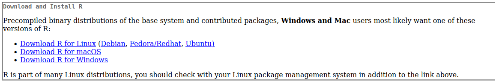
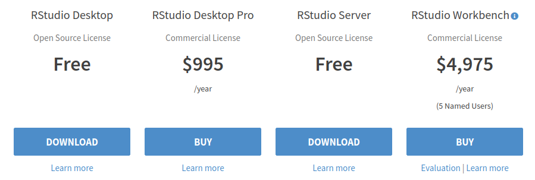

# intro-R

We will start by downloading the latest version of R - [here](https://cran.rstudio.com/)

Download R studio - https://www.rstudio.com/products/rstudio/download/

Scroll down and download Rstudio Desktop Free version

This will take you down to the installation and we need to select the operating
system we are working with (Windows, Mac, Ubuntu ...)

Please let me know if you have any issues